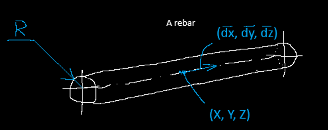
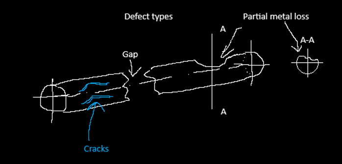
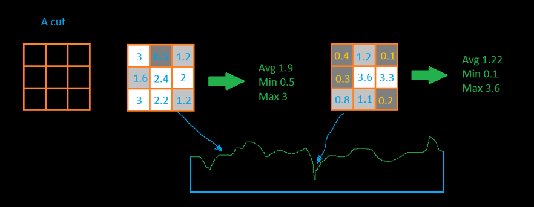
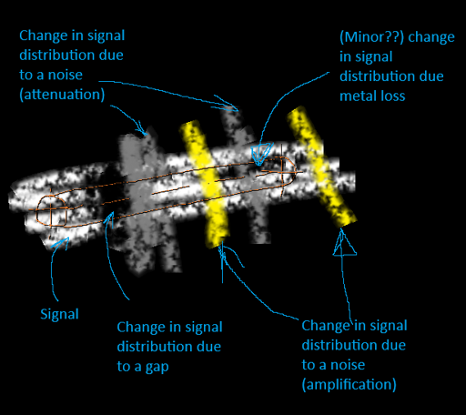
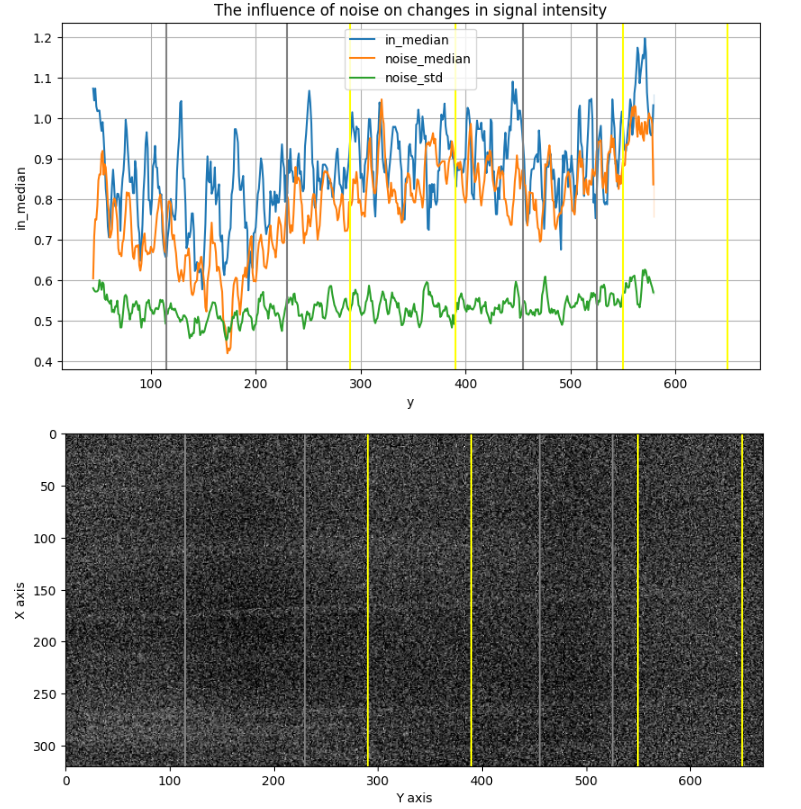
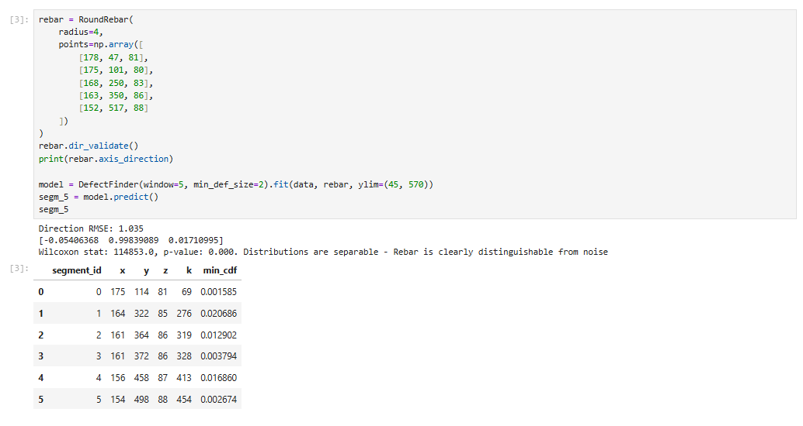

# Detection of steel rebar discontinuous in a reinforced concrete block using physical-statistical modeling

## Problem formulation

The goal of this work is to detect damage in steel rebars embedded in concrete (to find the locations where the steel is partially or fully damaged)

Formally, this is a defect (anomaly) detection problem in a 3D volume, where the model should return not only candidate to defect locations, but also it's confidence of how likely a detected anomaly is to correspond to a real defect rather than noise.


## Project structure
```
├── model
│   ├── __init__.py
│   ├── DefectFinder.py         # Model
│   └── Rebar.py                # class containing rebar parameters
├── Pictures
│   └── ...
├── .gitignore
├── data.npz                    # Original data (not provided)
├── model_application.ipynb     # application of the model
├── modelling.ipynb             # building the model
├── LICENSE
├── README.md
└── requirements.txt
```

## Solution description

### EDA conclusions

The input data are:
- An unlabeled 3D volume (x: 320, y: 670, z: 200) of scan of a concrete structure containing several rebars
- Voxel size 3 mm;
- The locations and number of defects are unknown;

The volume contains the signal intensity (I) for each voxel -> I(x, y, z). Intensities are in range (0, 4.67), mean: 0.85, std: 0.58. The signal intensity is lower in concrete than in steel. The number of concrete voxels is much greater than the number of steel ones.

The data is strongly noisy, so areas where the density of high-intensity signals is greater than the density of low-intensity signals likely contain a steel element. The noise is unevenly distributed - at a minimum, it varies along the X-axis (0-620).


### Model selection

#### Supervised tasks

Defect detection problems are often addressed using DL (3D CNN, ViT). However, these approaches have large amount of parameters and this why they require large amount of labeled data to avoid overfitting. I can't label the data manually because it takes a lot of time and I don't have the domain expertise.

That's why the problem should be solved as an unsupervised task.

#### Unsupervised tasks

Common unsupervised anomaly detection approaches such as one-class classification or PatchCore-like methods can't be applied because these methods assume training only on normal (healthy) examples. These approaches are based on extracting embedding vectors from training data, storing them in a memory bank, and then identifying defects by searching for the most dissimilar vectors from the test sample in comparison with vectors from the memory bank. Even if there is at least one defect example in the data, it's embedding would be saved in memory bank and break the model predictions. 

Because I can't guarantee that even one of the rebars is completely healthy, these approaches can't be applied.

#### Physics-driven modeling approach

To solve this problem I should go deeper into the physics of the objects under observations and go from studying the object, its functions, building a physical model, describing it using mathematics, putting forward a hypothesis and testing this hypothesis.

##### Task
Concrete blocks rebars defect detection using the signal intensities in 3D volume. 

##### For what?

Rebar is a cylindrical steel rod embedded in concrete to support tensile loads (concrete is excellent in compression and can withstand high loads, but it crashes even under light tensile loads). When the rebar breaks, the reinforced concrete block loses its design properties, so it's important to monitor its condition.

##### Rebar physical model

A rebar can be modeled as a long steel cylinder, whose length is much greater than its diameter. It can be described by:
- a direction vector of the axis;
- a point on the axis;
- a radius;
- boundary conditions along the axis.



##### Main types of defects

The main defect types considered are:
- complete breaks (gaps) - loss of connectivity between parts of the rebar;
- partial loss of metal, typically due to general corrosion, leading to a reduced cross-section.

Local defects such as pitting corrosion or narrow cracks are below the spatial resolution of the scan (voxel size 3 mm) and therefore can't be reliably detected.

So the task is reduced to detecting breaks and partial loss of metal.



##### Mathematical model

The signal intensity of voxel (x, y, z) can be expressed as:
$$I(x, y, z) = F_{material}(x, y, z) + (F_{noise}(x, y, z) + N_{noise}(\mu, \sigma))$$

where 
- $F_{material}(x, y, z)$ - a function that describes inner structure of concrete block
- $F_{noise}(x, y, z)$ - a function that describes the part of noise that depends on voxel coordinates (that varies along the y axis)
- $N_{noise}(\mu, \sigma)$ - normal noise part

##### Hypothesis 1: Find $F_{material}(x, y, z)$

The problem could be reduced to finding $F_{material}(x, y, z)$, in other words, to reconstructing the shape of the rebar form as it exists - with all defects. 

This is an inverse problem and has multiple solutions, especially because of the data is highly noisy.

##### Hypothesis 2: Estimate the probability that the material is steel $P(Material=steel | I, x, y, z)$ 

To estimate the probability that the material is steel $P(Material=steel | I, x, y, z)$ I used a Gaussian Mixture Model (GMM). To provide local context I computed some statistics (mean, std, min, max, p5, p95) for each voxel within cubic neighborhoods of size 27 (3^3) and 125 (5^3) voxels. And then trained two-component GMM (steel vs concrete) on this data.

The class with higher values of intensities belonged to steel. So I got the probability that a voxel's material was steel.
However, I was unable to configure it correctly because the data is heavily noisy and the model predicted a high probability of steel in locations where it was impossible, making the model's results unreliable.


##### Hypothesis 3: Transform the problem into a linear one and compare the distribution of statistics along the length of the rebar

I don’t need to evaluate the probability of steel in the volume, it only needs to evaluate the rebar condition in a conditionally given area, so I can use the knowledge about the shape of ideal rebar and translate the problem into a statistical one.

The key idea: If a local statistical value differs significantly from the sample mean, it means that the rebar structure in this location differs from the normal state, so there is a defect. I can use the p-value as the confidence level of the model.

The algorithm will be as follows:
- iterate along the cylinder axis, getting cross-sections (cuts) at each iteration;
- the voxel intensity values of each cut form a sample, from which I calculate statistics (sample statistics are more stable than individual ones) $$Stats(F_{material})$$
- then I compare the behavior of the statistics, identifying places where their behavior falls outside the confidence interval;
- determine the probability of encountering such an extreme value;
- classify locations with low probability as defective.

Simplified example with square cut (3*3) rebar:


However, there is still problem of noise that depends on the coordinates - that part of noise will affect on the statistics distribution, and insted of calcualating $$Stats(F_{material})$$ I can calculate only $$Stats(F_{material} + F_{noise} + N_{noise})$$



If I assume that with a small change in coordinate from the rebar area to the concrete one, the value of the material function will change greatly 
$$F_{material}(x, y, z) \neq F_{material}(y + dy, x + dx, z + dz)$$
and the local noise will be approximately the same
$$F_{noise}(x, y, z) \approx F_{noise}(y + dy, x + dx, z + dz)$$
then I can measure the statistics in the area near the rebar - measure the noise

By combining these two statistics I can get the changes of $F_{material}$

### Implementation of the approach

#### Two samples - rebar volume and noise_measurement_area

During the iteration, I will collect data from two volumes - a cylindrical one showing the signal intensity inside the rebar and a tube with wall thickness 'noise_msrt' - cover the cylinder and describe the area to measure the noise. 

Initial parameters of masks: rebar radius, points of rebars axis and noise measurement area parameters are determined manually. The axis is determined automatically by drawing a line between the specified points.


#### Iteration

For implementation simplicity I will iterate along the rebar axis. To do this, I will construct projections of the sections onto a plane perpendicular to the axis and will shift these projections to obtain samples along the length of the rebar


#### Statistics selection

Because I was solving this problem for the first time, I started experimenting, immediately measuring statistics that were similar in physical meaning and then comparing them.

Statistics:
- mean
- std
- median
- p5, p95 - percentiles

volumes:
- window=1 - statistics are calculated only in the layer
- window=3 - statistics are calculated in the volume with neighbor layers
- window=5 - statistics are calculated in the volume with 2 neighbor layers

Statistics types:
- in - statistics are calculated in the volume of rebar
- noise - statistics are calculated in the noise measurement area, next to the rebar


#### Statistical test to ensure that the mean distribution of statistics within a cylinder and the mean distribution in the noise measurement region are the same

I used a t-test or Wilcoxon statistical test (for samples with low p-value of Shapiro test) to test whether the distributions inside the cylinder and in the noise region differ significantly. p-value is lower than 0.05, so the means are not equal and there is statistically significant difference. This is a simple test to assess the correct orientation of the cylinder in the volume - there must be a difference

#### Reduce the noise - Signal-to-noise ratio - SNR

The problem is non-uniform noise, which varies along the Y-axis and affects the signal strength in dark (gray) and light (yellow) areas



To compensate $F_{noise}(x, y, z)$ - the noise depended on coordinates, I applied and compared several SNR approaches:
- snr_mean - by how many standard deviations of noise does the mean value in the rebar differ from the noise mean?
$$SNR_{mean} =  \frac{mean_{in} - mean_{noise}}{std_{noise}}$$
- snr_median - robust version of snr_mean
$$SNR_{median} =  \frac{median_{in} - median_{noise}}{p95_{in} - p95_{noise}}$$
- snr_p95 - observe the upper tail of the distribution to answer the question: Is there any metal in the area at all?
$$SNR_{p95} =  \frac{p95_{in} - p95_{noise}}{p95_{noise} - p5_{noise}}$$

#### Confidence estimation

Defects correspond to locally reduced signal intensity -> to locally low SNR values.

Instead of estimating $P(Material=steel | I, x, y, z)$ the task becomes estimating the probability of observing such a low SNR value $P(snr_i | SNR)$. The p-value (the probability of observing such or an even more extreme value) is suitable for calculating the confidence of the model

I can use distribution-based p-value (with cumulative distribution function). Due to the large tails of the distribution, the t-distribution was taken as the baseline. In this case, low cdf values will indicate a high chance of finding a defect at this point.

Alternatively, the logistic function can be used.
$$logistic_i = \frac{1}{1 + \exp(steepness * (\frac{snr_i - median(SNR)}{std(SNR)} - threshold))}$$
where 
- threshold = -3 - the threshold in standard deviations beyond which a location is considered potentially hazardous
- steepness - logistic function slope

But the above parameters need to be calibrated on the marked data

In any case, these probabilities only indicate the confidence of the model, and not the probability of a defect because I do not have labeled data.

#### Model implementation
I wrote a class following sklearn-like interface. Firstly, created an instance of the 'DefectFinder' class (the main class)  is created, which accepts parameters: 
- statistics used to calculate SNR;
- the threshold, below or under which the model will recognize as a defect
- the minimum defect size (to combat noisy outlies, it's possible to specify that only locations with at least two consecutive low-probability voxels are considered defects)
- maximum distance between adjacent defects for merging into a single defect.

Then called the 'fit(volume, rebar)' method to pass the initial data and the rebar object, which contains the rebar parameters, to the model. At this stage statistics and SNR-metric were computed and validated correct separation between signal and noise distributions. These results might be exported as a DataFrame for manual inspection.

Then called the 'predict()' method that returned detected defects grouped by location with confidence scores.



#### Stability analysis

Since the data is unlabeled, a stability analysis was performed to determine whether similar results were obtained when changing the model's hyperparameters.

- When changing the model's hyperparameters (window width), the response changed significantly, some areas appeared and disappeared, and the confidence values changed. Although confidence values vary depending on the hyperparameters, some defect locations remain stable.
- The outputs of the logistic function are similar to those obtained using the CDF.
- When setting random axis parameters, the model correctly identifies the rebar as indistinguishable from noise.
- As the rebar radius parameter increases, the signal remains separated from the noise, but the number of defects increases—this is due to the influence of noise.
- The approach was successfully applied to other rebars, where the detected defects visually correspond to darker areas in the scan.

### Pros and Cons

#### Limitations:
- the approach represents the rebar as an ideal cylinder, which is a strong assumption since it does not take into account the deformations of the rebar (more accurate masks can be constructed that take deformations into account)
- the orientation of the cylinder and its parameters are determined by a person, which is labor-intensive and very inaccurate
- the orientation of the cylinder and its parameters are determined by a person, which is labor-intensive and very inaccurate
- susceptible to noise in the data

#### Advantages:
- simple and fast
- interpretable model
- nice baseline model - may be improved